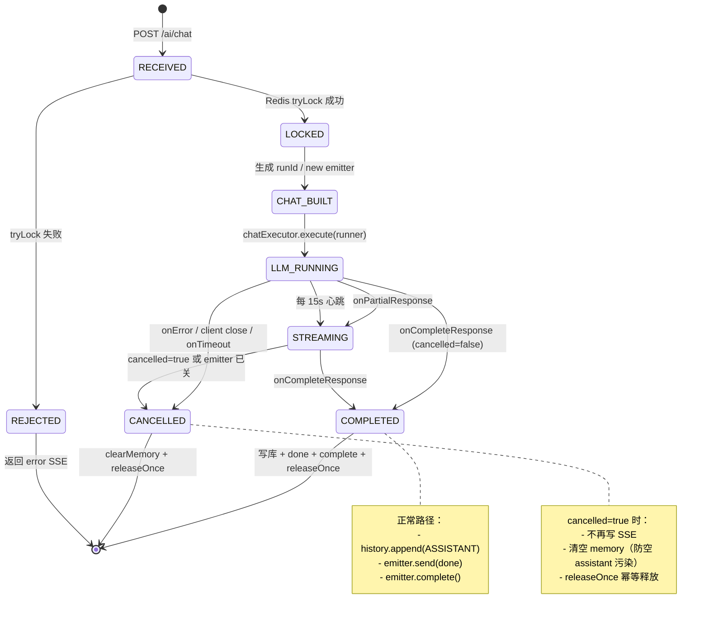
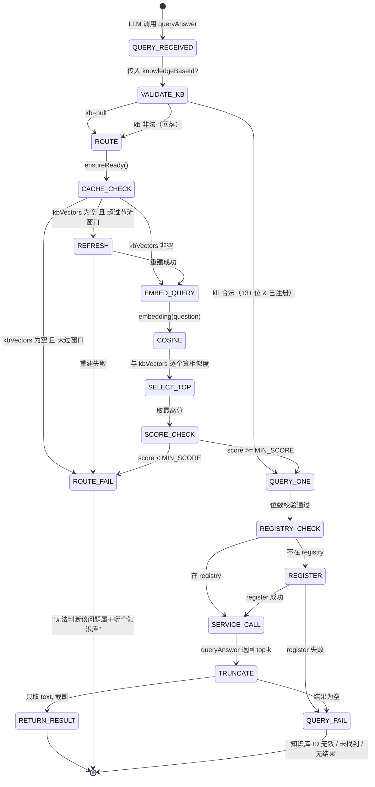
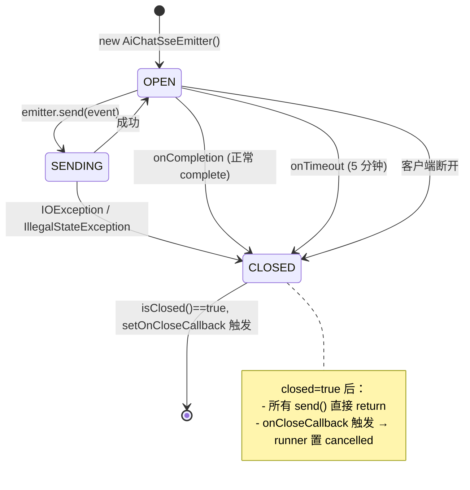
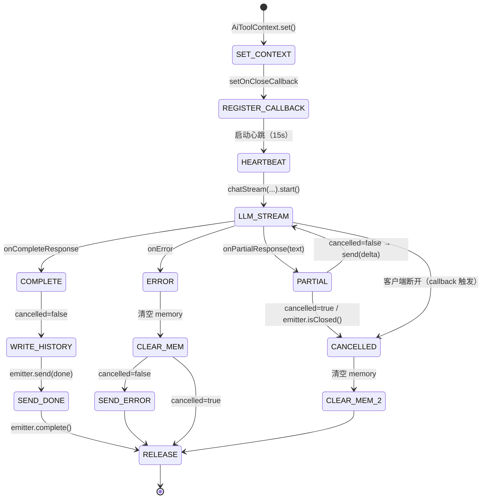

1. **完整技术总结**（十二节）

2. **源码级注释**（`KnowledgeRouter`、`AiAgentRunner`、`KnowledgeAgentTools` 三个核心类的逐行/逐段说明）

3. **状态机图**（Mermaid 格式，支持 GitHub / Typora / VSCode 渲染，也附了 ASCII 版兜底）

* * *

markdown

# Agent 自动路由知识库 —— 全流程技术总结（含源码注释与状态机）

> 版本：2026-09-29  
> 适用范围：iam-backend-ai / com.lenovo.ai 包  
> 涉及组件：AiAgentController、AiAgentService、AiAgentRunner、KnowledgeAssistant、KnowledgeAgentManager、KnowledgeAgentTools、KnowledgeRouter、KnowledgeRegistrar、AiChatSseEmitter

---

## 目录

1. [整体架构](#一整体架构)
2. [核心组件职责](#二核心组件职责)
3. [知识库路由的完整链路](#三知识库路由的完整链路)
4. [关键"防坑"设计](#四关键防坑设计)
5. [模型选择](#五模型选择)
6. [Prompt 对齐要点](#六prompt-对齐要点)
7. [Redis 锁机制](#七redis-锁机制)
8. [线程池](#八线程池)
9. [完整日志排查清单](#九完整日志排查清单)
10. [关键经验教训](#十关键经验教训)
11. [配置参考](#十一配置参考)
12. [后续可优化方向](#十二后续可优化方向)
13. [源码级注释](#十三源码级注释)
14. [状态机图](#十四状态机图)

---

## 一、整体架构

```
用户提问
   ↓
POST /ai/chat (SSE)
   ↓
AiAgentController → AiAgentService → AiAgentRunner（异步）
   ↓
KnowledgeAssistant.chatStream（LangChain4j AiServices）
   ↓
LLM 决定是否调用 queryAnswer 工具
   ↓
KnowledgeAgentTools.queryAnswer
   ↓
KnowledgeRouter.route(question)  ← 向量路由
   ↓
queryOne → KnowledgeService.queryAnswer → 返回 top-k 结果
   ↓
tool 结果回传 LLM → LLM 生成最终答案
   ↓
SSE delta 事件流 → 前端渲染
```

---

## 二、核心组件职责

| 组件                        | 职责                                                                                     |
| ------------------------- | -------------------------------------------------------------------------------------- |
| `AiAgentController`       | 暴露 `/ai/chat` (SSE)、`/ai/chat/stop` 接口                                                 |
| `AiAgentService`          | 生成 `runId`、抢 Redis 锁、注册 SSE emitter、提交线程池                                              |
| `AiAgentRunner`           | 在异步线程里跑 LLM 流；心跳；处理 cancelled；清理 memory                                                |
| `KnowledgeAssistant`      | LangChain4j 接口，`@SystemMessage` + `@Tool` 自动调用                                         |
| `KnowledgeAgentManager`   | 按 `knowledgeId` 缓存 assistant 实例；缓存 `ChatMemory`                                        |
| `KnowledgeAgentTools`     | 工具实现：`listProjects`、`listKnowledgeBases`、`listDocuments`、`getPageChunks`、`queryAnswer` |
| `KnowledgeRouter`         | 对问题 embedding，与知识库描述向量算余弦相似度，选 top-1                                                   |
| `KnowledgeRegistrar`      | 校验知识库归属项目 79，注册到 `KnowledgeTemplateRegistry`                                           |
| `KmverseRetrieverFactory` | 可选：为 assistant 绑定 `ContentRetriever`，做 RAG 自动检索                                        |

---

## 三、知识库路由的完整链路

### 3.1 触发方式

- **显式路由**：前端传 `knowledgeId` → `AiAgentRunner` 注册并走指定库。
- **隐式路由**：LLM 调 `queryAnswer(kb=null)` → `KnowledgeRouter.route(question)` 自动选库。
  
  ### 3.2 路由算法（`KnowledgeRouter`）
1. **后台预热**（`@PostConstruct`，每 10 分钟刷新）：
   - 拉所有知识库 ID → 为每个库构建描述文本（文档标题串接）→ 调 embedding → 存 `kbVectors`。
   - 单个知识库失败不影响其他，失败项下轮重试。
2. **请求链路上兜底**：缓存为空时（`kbVectors.isEmpty()`）做一次**节流重建**（`retryBackoffMillis=60000`）。
3. **匹配**：
   - `embedding(question)` → 与 `kbVectors` 每个向量算余弦相似度；
   - 取分数最高者，若 `score < MIN_SCORE (0.5)` 则返回 `null`，由调用方处理。
     
     ### 3.3 关键参数
     
     ```java
     MIN_SCORE = 0.5;              // 相似度阈值
     MAX_DESC_LENGTH = 500;        // 描述截断
     refreshMinutes = 10;          // 刷新周期
     retryBackoffMillis = 60000;   // 请求链路兜底重建间隔
     DEFAULT_PROJECT_ID = 79;      // 知识库归属项目
     ```

---

## 四、关键"防坑"设计

### 4.1 KnowledgeAgentTools 里的位数校验

**问题**：LLM 会把工作区 ID（如 `21408`、`79`）误传为 `knowledgeBaseId`。
**方案**：统一用 `MIN_KB_ID_LENGTH = 13` 作为最小位数，要求：

- 13 位及以上纯数字；
- 且 `templateRegistry.get(s) != null`。
  **两处都要判断**（易漏）：
  
  ```java
  // ① isValidKnowledgeId
  private boolean isValidKnowledgeId(Long id) {
    if (id == null) return false;
    String s = String.valueOf(id);
    if (s.length() < MIN_KB_ID_LENGTH || !s.matches("\\d+")) return false;
    return templateRegistry.get(s) != null;
  }
  // ② queryOne 开头
  if (knowledgeId.length() < MIN_KB_ID_LENGTH || !knowledgeId.matches("\\d+")) {
    return "知识库 ID 无效：" + knowledgeId + "（应为 13 位及以上数字）";
  }
  ```
  
  ### 4.2 Memory 隔离
  
  **问题**：不同知识库共用同一 memoryId，导致 tool 消息序列错乱、上下文污染。
  **方案**：
- `AiAgentRunner` 里拼 `effectiveMemoryId = memoryId + ":" + knowledgeId`；
- `KnowledgeAgentManager.buildAssistant` 里用 `MessageWindowChatMemory.builder().id(memoryId).maxMessages(10).build()`；
- **必须带 `.id(memoryId)`**，否则所有会话共享一个 memory。
  
  ### 4.3 Memory 污染清空
  
  **问题**：`cancelled=true` 时，LangChain4j 仍会把**空的 `AiMessage`** 写进 memory；下次请求 messages 里带空 `{"role":"assistant"}`，LLM 直接拒绝生成（`length=0`）。
  **方案**：
- `KnowledgeAgentManager` 里用 `memoryCache` 保存 `memoryId -> ChatMemory`；
- 暴露 `clearMemory(memoryId)`；
- `AiAgentRunner.onCompleteResponse` / `onError` 里，**凡是 `cancelled=true` 或 `onError`** 都调 `agentManager.clearMemory(effectiveMemoryId)`。
  
  ### 4.4 SSE 断连与心跳
  
  **问题**：LLM 思考+工具调用长达 20~50s 空窗期，SSE 被网关/代理断开，`emitter.send` 抛 `IllegalStateException`。
  **方案**：
- `AiChatSseEmitter` 每 15s 发 `event().comment("hb")`（`AiAgentRunner` 里调度）；
- `AiChatSseEmitter` 暴露 `isClosed()` + `setOnCloseCallback`，连接关闭时把 `cancelled` 置 true；
- `application.yml` 里 `spring.mvc.async.request-timeout: 300000`，Nginx 侧 `proxy_read_timeout 300s`。
  
  ### 4.5 stop 误伤新请求
  
  **问题**：前端切换问题时 `stop` + `chat` 几乎同时发出，`stop` 会误停刚建立的新 emitter。
  **方案（方案 B++++）**：
- `stop()` 变成**空操作**（仅打日志）；
- `chat()` 里**新请求进来时，无条件 `complete` 同 `memoryId` 的旧 emitter**；
- 旧请求的 `setOnCloseCallback` 触发 → `cancelled=true` → 停止写 SSE。
  
  ### 4.6 tool 返回精简
  
  **问题**：`KnowledgeService.queryAnswer` 返回完整 JSON（每条约 2KB），10 条就是 20KB，prompt 撑爆上下文。
  **方案**：
- 只取 `text` 字段，最多 3~5 条，每条截断 500~800 字；
- 去掉 `<!-- -->` 注释。

---

## 五、模型选择

| 模型名                                                                                                                                                                        | 用途           | 备注                                                     |
| -------------------------------------------------------------------------------------------------------------------------------------------------------------------------- | ------------ | ------------------------------------------------------ |
| `qwen-max`                                                                                                                                                                 | **推荐**，工具调用稳 | 不思考，输出直接                                               |
| `qwen3-max`                                                                                                                                                                | 更强推理         | 需关 thinking（`enable_thinking=false`），`temperature=0.3` |
| `qwen-audio-*`                                                                                                                                                             | ❌ 语音识别       | 不支持 `/chat/completions`                                |
| `*-realtime`                                                                                                                                                               | ❌ 实时语音       | 同上                                                     |
| `text-embedding-v3`                                                                                                                                                        | 向量           | 正确                                                     |
| **关键教训**：中途把 `chat-model.model-name` 改成 `qwen-audio-3.1-asr-flash`、`qwen3.8-omni-flash-realtime` 这类非法名，服务端会返回 200 + `application/json` + 空 body，LangChain4j 直接 `length=0`。 |              |                                                        |

---

## 六、Prompt 对齐要点

`SYSTEM_PROMPT` 和 `@P` 描述**必须一致**，否则 LLM 会犹豫：

- ✅ 统一为"**13 位及以上纯数字**"；
- ✅ 明确"**除非用户本次对话中明确说出，否则 `knowledgeBaseId` 一律不传**"；
- ✅ 明确"**系统会自动路由**，禁止从历史消息、工具返回值、上下文中推断 ID"。

---

## 七、Redis 锁机制

- `AiAgentService.chat()` 用 `redisLockHelper.tryLock(lockKey, token, 60_000)`；
- `AiAgentRunner` 跑完或异常时 `releaseOnce` 释放；
- 新请求进来时**先 `forceUnlock` 旧锁，再 `tryLock`**，避免旧请求没跑完导致新请求被拒；
- `memoryId` 是锁的粒度的基础：`userId + ":" + sessionId`。

---

## 八、线程池

`AiChatExecutor`：

- 核心线程 0，最大 `ai.chat.max-concurrent`（默认 16）；
- 队列容量 `ai.chat.queue-capacity`（默认 100）；
- 拒绝策略 `AbortPolicy`，`submit()` 捕获 `RejectedExecutionException` 返回 false，由调用方处理。

---

## 九、完整日志排查清单

切换问题时，日志应有以下关键行：
| 日志行 | 含义 |
|---|---|
| `>>> 新请求进来，强制停掉旧 emitter` | 方案 B++++ 生效 |
| `[RUN] start stream, ..., effectiveMemoryId=laijf2:xxx:737xxx` | memoryId 已隔离 |
| `[Tool] queryAnswer kb=null q=...` | LLM 未乱传 ID |
| `>>> 路由结果：knowledgeBaseId=..., score=0.6x` | 路由成功 |
| `[Tool] queryOne kb=... 返回 N 条, 总长 ~1000` | 检索成功 |
| `>>> stream complete, cancelled=false, length=N` | 正常完成 |
**异常信号**：

- `SSE already closed, ignore send` → 连接断开或心跳失效
- `知识库 ID 无效：...（应为 13 位数字）` → 位数校验没改全
- `content-type: application/json` → 模型名不对
- `length=0` → memory 被污染或 LLM 静默拒绝

---

## 十、关键经验教训

1. **memoryId 一定要带 `.id()`**，否则所有会话共享 memory。
2. **13 位判断有两处**，改一处漏一处是常见 bug。
3. **模型名不能乱改**，非对话模型会返回 200 + 空 body。
4. **SSE 长连接要心跳**，否则网关 30s 空闲就断。
5. **cancelled=true 必须清 memory**，否则空 assistant 污染下次请求。
6. **stop 和 chat 时序不可控**，与其在 stop 里猜，不如让新 chat 主动停旧 emitter。
7. **tool 返回要精简**，否则 prompt 撑爆上下文。
8. **prompt 和 @P 描述要一致**，否则 LLM 会犹豫。

---

## 十一、配置参考

```yaml
spring:
  mvc:
    async:
      request-timeout: 300000
server:
  tomcat:
    connection-timeout: 300000
langchain4j:
  open-ai:
    base-url: https://ws-xxx.cn-beijing.maas.aliyuncs.com/compatible-mode/v1
    api-key: <key>
    chat-model:
      model-name: qwen-max
    embedding-model:
      model-name: text-embedding-v3
  http:
    timeout-seconds: 120
    max-retries: 3
ai:
  chat:
    enabled: true
    max-concurrent: 16
    queue-capacity: 100
    keep-alive-seconds: 60
  knowledge-router:
    refresh-minutes: 10
    retry-backoff-millis: 60000
```

---

## 十二、后续可优化方向

1. **升级 LangChain4j 到 1.x**：支持 `TokenStream.cancel()`，客户端断开时能真正中断底层 HTTP 请求，省 token。
2. **前端 `AbortController`**：切换问题时主动 `abort()` 上一个 fetch，比后端"新 chat 停旧 emitter"更省资源。
3. **知识库描述优化**：目前 `KnowledgeRouter.buildDescription` 只取文档标题，区分度低；可考虑用 chunk 摘要或领域关键词。
4. **`MIN_SCORE` 动态调整**：目前写死 0.5，可根据历史命中率自适应。
5. **多级路由**：先按工作区分组，再组内路由，减少候选集。

---

## 十三、源码级注释

### 13.1 `KnowledgeRouter` 源码逐段注释

```java
@Slf4j
@Component
@RequiredArgsConstructor
public class KnowledgeRouter {
    // —— 常量 ——
    private static final Integer DEFAULT_PROJECT_ID = 79;        // 知识库归属项目
    private static final String  DEFAULT_IT_CODE   = "laijf2";   // 备用 userId
    private static final double  MIN_SCORE         = 0.5;        // 余弦相似度阈值
    private static final int     MAX_DESC_LENGTH   = 500;        // 描述截断长度
    // —— 依赖 ——
    private final KnowledgeService knowledgeService;             // 拉知识库/文档
    private final EmbeddingModel   embeddingModel;               // text-embedding-v3
    // —— 可配置项 ——
    @Value("${ai.knowledge-router.refresh-minutes:10}")
    private long refreshMinutes;                                  // 后台刷新周期（分钟）
    @Value("${ai.knowledge-router.retry-backoff-millis:60000}")
    private long retryBackoffMillis;                              // 请求链路兜底重建的最小间隔
    // —— 状态 ——
    private final Map<Long, float[]> kbVectors     = new ConcurrentHashMap<>(); // kbId -> 描述向量
    private final Map<Long, String>  kbDescriptions = new ConcurrentHashMap<>(); // kbId -> 描述文本
    private final AtomicBoolean refreshing = new AtomicBoolean(false);           // 刷新互斥
    private volatile long lastAttemptAt = 0L;                                    // 上次刷新时间戳
    // 单线程守护调度器，用于后台周期性刷新
    private final ScheduledExecutorService refresher =
            Executors.newSingleThreadScheduledExecutor(r -> {
                Thread t = new Thread(r, "knowledge-router-refresher");
                t.setDaemon(true);
                return t;
            });
    /**
     * 启动时注册后台刷新任务。
     * ⚠️ 不在启动线程里做远程调用（embedding 调用），避免一次网络抖动拖慢应用启动。
     */
    @PostConstruct
    public void init() {
        long interval = Math.max(1L, refreshMinutes);
        refresher.scheduleWithFixedDelay(this::refreshQuietly, 0L, interval, TimeUnit.MINUTES);
        log.info(">>> KnowledgeRouter 已启动后台向量刷新，间隔 {} 分钟", interval);
    }
    @PreDestroy
    public void destroy() {
        refresher.shutdownNow();
    }
    /** 带异常兜底的刷新；失败时保留已有缓存继续服务 */
    private void refreshQuietly() {
        try {
            refresh();
        } catch (Exception e) {
            log.error(">>> KnowledgeRouter 向量刷新失败，沿用现有缓存（{} 个）", kbVectors.size(), e);
        }
    }
    /**
     * 重建所有知识库的描述向量。
     * - 单个知识库失败不影响其他，失败项留待下轮重试。
     * - 使用 AtomicBoolean 做互斥，避免并发刷新。
     * @return true 表示本次真的执行了刷新；false 表示已有线程在刷新
     */
    private boolean refresh() {
        if (!refreshing.compareAndSet(false, true)) {
            return false;
        }
        lastAttemptAt = System.currentTimeMillis();
        try {
            List<Long> kbIds = getAllKnowledgeBaseIds();
            int success = 0;
            for (Long kbId : kbIds) {
                try {
                    String desc = buildDescription(kbId);           // 构造描述文本
                    if (desc == null || desc.isBlank()) continue;
                    if (desc.length() > MAX_DESC_LENGTH) desc = desc.substring(0, MAX_DESC_LENGTH);
                    float[] vec = embeddingModel.embed(desc).content().vector();  // 调 embedding
                    kbVectors.put(kbId, vec);
                    kbDescriptions.put(kbId, desc);
                    success++;
                } catch (Exception e) {
                    // 单个失败不影响整体
                    log.warn(">>> 知识库 {} 描述向量生成失败，将在下次刷新时重试", kbId, e);
                }
            }
            log.info(">>> KnowledgeRouter 刷新完成，成功 {} / 共 {}，缓存 {}",
                    success, kbIds.size(), kbVectors.size());
            return true;
        } finally {
            refreshing.set(false);
        }
    }
    /**
     * 请求链路上的兜底：
     * - 缓存为空时（预热未完成 or 一直失败），尝试就地重建。
     * - 带节流（retryBackoffMillis），避免每个请求都去打下游。
     */
    private void ensureReady() {
        if (!kbVectors.isEmpty()) return;
        if (System.currentTimeMillis() - lastAttemptAt < retryBackoffMillis) return;
        try {
            refresh();
        } catch (Exception e) {
            log.warn(">>> KnowledgeRouter 兜底重建向量失败", e);
        }
    }
    /**
     * 路由主入口：
     * 1. 空问题返回 null；
     * 2. 缓存空则兜底重建；
     * 3. 对问题做 embedding，与每个知识库的向量算余弦相似度，取最高；
     * 4. 分数低于 MIN_SCORE 返回 null。
     */
    public Long route(String question) {
        if (question == null || question.isBlank()) return null;
        ensureReady();
        if (kbVectors.isEmpty()) {
            log.warn(">>> 知识库向量缓存为空，跳过路由");
            return null;
        }
        float[] questionVec = embeddingModel.embed(question).content().vector();
        Long bestKbId = null;
        double bestScore = -1;
        for (Map.Entry<Long, float[]> entry : kbVectors.entrySet()) {
            double score = cosine(questionVec, entry.getValue());
            if (score > bestScore) {
                bestScore = score;
                bestKbId = entry.getKey();
            }
        }
        log.info(">>> 路由结果：knowledgeBaseId={}, score={}", bestKbId, bestScore);
        if (bestScore < MIN_SCORE) {
            log.warn(">>> 路由相似度低于阈值 {}，不选知识库", MIN_SCORE);
            return null;
        }
        return bestKbId;
    }
    /** 与 route 类似，返回 top-N；供多库融合检索备用 */
    public List<Long> routeTopN(String question, int n) {
        if (question == null || question.isBlank()) return List.of();
        ensureReady();
        if (kbVectors.isEmpty()) return List.of();
        float[] questionVec = embeddingModel.embed(question).content().vector();
        List<Map.Entry<Long, float[]>> entries = new ArrayList<>(kbVectors.entrySet());
        entries.sort(Comparator.comparingDouble(
                (Map.Entry<Long, float[]> e) -> -cosine(questionVec, e.getValue())));
        List<Long> result = new ArrayList<>();
        for (int i = 0; i < Math.min(n, entries.size()); i++) {
            result.add(entries.get(i).getKey());
        }
        return result;
    }
    /**
     * 构造知识库描述文本：取该库前 10 个文档的标题。
     * ⚠️ 目前区分度有限，可优化为 chunk 摘要 / 领域关键词。
     */
    private String buildDescription(Long kbId) {
        StringBuilder sb = new StringBuilder();
        try {
            JSONObject docResp = knowledgeService.getDocuments(String.valueOf(kbId));
            JSONArray docs = docResp.getJSONArray("result");
            if (docs == null) docs = docResp.getJSONArray("data");
            if (docs != null && !docs.isEmpty()) {
                sb.append("知识库 ").append(kbId).append(" 包含文档：");
                int count = 0;
                for (int i = 0; i < docs.size() && count < 10; i++) {
                    JSONObject o = docs.getJSONObject(i);
                    JSONArray rows = o.getJSONArray("rows");
                    if (rows == null) continue;
                    for (int j = 0; j < rows.size() && count < 10; j++) {
                        String title = rows.getJSONObject(j).getString("originName");
                        if (title != null && !title.isBlank()) {
                            sb.append(title).append("；");
                            count++;
                        }
                    }
                }
                sb.append("\n");
            }
        } catch (Exception e) {
            log.warn("获取知识库 {} 文档失败", kbId, e);
        }
        return sb.toString();
    }
    /** 拉所有知识库 ID（项目 79 下） */
    private List<Long> getAllKnowledgeBaseIds() {
        try {
            ProjectBase base = new ProjectBase();
            base.setProjectId(DEFAULT_PROJECT_ID);
            base.setItCode(DEFAULT_IT_CODE);
            List<Long> ids = knowledgeService.queryKnowledgeBase(base);
            return ids == null ? new ArrayList<>() : ids;
        } catch (Exception e) {
            log.warn("查询知识库列表失败", e);
            return new ArrayList<>();
        }
    }
    /** 余弦相似度 */
    private static double cosine(float[] a, float[] b) {
        if (a == null || b == null || a.length != b.length) return 0;
        double dot = 0, normA = 0, normB = 0;
        for (int i = 0; i < a.length; i++) {
            dot += a[i] * b[i];
            normA += a[i] * a[i];
            normB += b[i] * b[i];
        }
        if (normA == 0 || normB == 0) return 0;
        return dot / (Math.sqrt(normA) * Math.sqrt(normB));
    }
}
```

**要点提炼**：
| 位置 | 关键点 |
|---|---|
| `@PostConstruct` | 后台异步预热，不阻塞启动 |
| `AtomicBoolean refreshing` | 刷新互斥，防止并发打爆下游 |
| `ensureReady()` + `lastAttemptAt` | 请求链路兜底，带 60s 节流 |
| `MIN_SCORE = 0.5` | 相似度阈值，低于则返回 null |
| `buildDescription()` | 目前只取标题，**是精度瓶颈** |

---

### 13.2 `AiAgentRunner` 源码逐段注释

```java
@Slf4j
@Component
@RequiredArgsConstructor
public class AiAgentRunner {
    private static final long HEARTBEAT_INTERVAL_SECONDS = 15L;
    private final KnowledgeAgentManager agentManager;
    private final ChatHistoryStore      history;
    private final RedisLockHelper       redisLockHelper;
    public void run(ChatRequest request,
                    AiToolContext context,
                    String userId,
                    boolean newSession,
                    String sessionId,
                    long userMessageId,
                    long assistantMessageId,
                    Locale locale,
                    String memoryId,
                    String lockKey,
                    String lockToken,
                    AiChatSseEmitter emitter,
                    String runId) {
        StringBuilder full = new StringBuilder();
        // —— 1. 把上下文绑定到当前线程（工具 currentUserId() 靠它） ——
        AiToolContext.set(context);
        // —— 2. 取消标记 & 资源释放幂等标记 ——
        AtomicBoolean cancelled = new AtomicBoolean(false);
        AtomicBoolean released  = new AtomicBoolean(false);
        // —— 3. 注册"客户端断开"回调：置 cancelled，让 onPartialResponse 提前 return ——
        emitter.setOnCloseCallback(() -> {
            if (cancelled.compareAndSet(false, true)) {
                log.warn("[RUN] emitter closed by client, cancel stream. sessionId={}, runId={}",
                        sessionId, runId);
            }
        });
        // —— 4. SSE 心跳：每 15s 发一个 comment，避免长空窗被网关断开 ——
        ScheduledExecutorService heartbeatScheduler =
                Executors.newSingleThreadScheduledExecutor(r -> {
                    Thread t = new Thread(r, "sse-heartbeat-" + sessionId);
                    t.setDaemon(true);
                    return t;
                });
        ScheduledFuture<?> heartbeat = heartbeatScheduler.scheduleAtFixedRate(() -> {
            if (cancelled.get() || emitter.isClosed()) {
                cancelled.set(true);
                return;
            }
            try {
                emitter.send(SseEmitter.event().comment("hb"));
            } catch (Exception ignored) { /* 连接已断，忽略 */ }
        }, HEARTBEAT_INTERVAL_SECONDS, HEARTBEAT_INTERVAL_SECONDS, TimeUnit.SECONDS);
        // —— 5. 幂等的资源释放：心跳停 + 上下文清 + Redis 解锁 ——
        Runnable releaseOnce = () -> {
            if (released.compareAndSet(false, true)) {
                try { heartbeat.cancel(true); }              catch (Exception ignored) {}
                try { heartbeatScheduler.shutdownNow(); }    catch (Exception ignored) {}
                try { AiToolContext.clear(); }               catch (Exception e) { log.warn("AiToolContext.clear failed", e); }
                try { redisLockHelper.unlock(lockKey, lockToken); }
                catch (Exception e) { log.debug("redis unlock skipped: {}", e.getMessage()); }
            }
        };
        // —— 6. emitter 生命周期结束（正常/超时）都触发 releaseOnce ——
        emitter.onCompletion(() -> {
            log.info("SSE onCompletion(runner), sessionId={}, runId={}", sessionId, runId);
            releaseOnce.run();
        });
        try {
            // —— 7. 写自己的历史库（与 LangChain4j 的 memory 无关） ——
            history.append(sessionId, userId, userMessageId, "USER", request.message(), null);
            String knowledgeId = request.knowledgeId();
            // —— 8. knowledgeId 校验：只接受 13 位及以上纯数字 ——
            if (knowledgeId != null && !knowledgeId.isBlank()
                    && !knowledgeId.matches("\\d{13,}")) {
                log.warn("[RUN] 非法 knowledgeId={}，忽略并走自动路由", knowledgeId);
                knowledgeId = null;
            }
            // —— 9. 拼 user message，把 userId 与 knowledgeId 注入 prompt ——
            String message = "当前登录用户：" + userId + "\n用户问题：" + request.message();
            // —— 10. 换知识库时给 memoryId 加后缀，天然隔离历史 ——
            String effectiveMemoryId = memoryId;
            if (knowledgeId != null && !knowledgeId.isBlank()) {
                agentManager.register(knowledgeId);
                effectiveMemoryId = memoryId + ":" + knowledgeId;
                message = "当前登录用户：" + userId
                        + "\n当前知识库 ID：" + knowledgeId
                        + "\n用户问题：" + request.message();
            }
            final String finalEffectiveMemoryId = effectiveMemoryId;  // lambda 里用
            KnowledgeAssistant assistant = agentManager.getAssistant(knowledgeId);
            log.info("[RUN] start stream, sessionId={}, knowledgeId={}, effectiveMemoryId={}, runId={}",
                    sessionId, knowledgeId, finalEffectiveMemoryId, runId);
            // —— 11. 调 LLM 流 ——
            assistant.chatStream(finalEffectiveMemoryId, message)
                    .onRetrieved(contents -> {
                        // RAG 检索回调（如果 assistant 绑定了 ContentRetriever）
                        if (log.isDebugEnabled()) {
                            log.debug("retrieved {} contents, sessionId={}",
                                    contents == null ? 0 : contents.size(), sessionId);
                        }
                    })
                    .onPartialResponse(text -> {
                        // —— 12. 已取消 / emitter 已关 → 丢弃，不再写 SSE ——
                        if (cancelled.get() || emitter.isClosed()) {
                            cancelled.set(true);
                            return;
                        }
                        full.append(text);
                        try {
                            emitter.send(SseEmitter.event()
                                    .name("delta")
                                    .data(Map.of("text", text)));
                        } catch (Exception e) {
                            log.warn("emitter send delta failed: {}", e.getMessage());
                            cancelled.set(true);
                        }
                    })
                    .onCompleteResponse(response -> {
                        log.info(">>> stream complete, sessionId={}, runId={}, cancelled={}, length={}",
                                sessionId, runId, cancelled.get(), full.length());
                        // —— 13. 关键：cancelled=true 时清 memory，避免空 assistant 污染 ——
                        if (cancelled.get()) {
                            try {
                                agentManager.clearMemory(finalEffectiveMemoryId);
                                log.info(">>> cancelled=true，清空 memory, memoryId={}", finalEffectiveMemoryId);
                            } catch (Exception e) {
                                log.warn("clearMemory failed", e);
                            }
                            releaseOnce.run();
                            return;
                        }
                        try {
                            history.append(sessionId, userId, assistantMessageId,
                                    "ASSISTANT", full.toString(), null);
                            try { emitter.send(SseEmitter.event().name("done").data("{}")); }
                            catch (Exception ignored) {}
                            emitter.complete();
                        } finally {
                            releaseOnce.run();
                        }
                    })
                    .onError(error -> {
                        log.error(">>> chat stream error, sessionId={}, runId={}, cancelled={}",
                                sessionId, runId, cancelled.get(), error);
                        // —— 14. onError 也清 memory ——
                        try {
                            agentManager.clearMemory(finalEffectiveMemoryId);
                            log.info(">>> onError，清空 memory, memoryId={}", finalEffectiveMemoryId);
                        } catch (Exception e) {
                            log.warn("clearMemory failed", e);
                        }
                        if (cancelled.get()) {
                            releaseOnce.run();
                            return;
                        }
                        try {
                            emitter.send(SseEmitter.event()
                                    .name("error")
                                    .data(Map.of("message",
                                            error.getMessage() == null ? "未知错误" : error.getMessage())));
                        } catch (Exception ignored) {}
                        try { emitter.complete(); } catch (Exception ignored) {}
                        releaseOnce.run();
                    })
                    .start();
            log.info("[RUN] stream started, sessionId={}, runId={}", sessionId, runId);
        } catch (Exception e) {
            log.error("run error, sessionId={}, runId={}", sessionId, runId, e);
            cancelled.set(true);
            // —— 15. 入口异常也要清 memory ——
            try { agentManager.clearMemory(memoryId); } catch (Exception ignored) {}
            try {
                emitter.send(SseEmitter.event()
                        .name("error")
                        .data(Map.of("message",
                                e.getMessage() == null ? "未知错误" : e.getMessage())));
            } catch (Exception ignored) {}
            try { emitter.complete(); } catch (Exception ignored) {}
            releaseOnce.run();
        }
    }
}
```

**要点提炼**：
| 位置 | 关键点 |
|---|---|
| `setOnCloseCallback` | 客户端断开 → `cancelled=true` → 停止写 SSE |
| 心跳线程 | 每 15s 一个 `comment`，防网关断连 |
| `releaseOnce` | 心跳、上下文、Redis 锁的幂等释放 |
| `onCompleteResponse` | `cancelled=true` 时清 memory；否则写库 + `done` + `complete` |
| `onError` | **总是**清 memory，再决定是否发 error 事件 |
| `effectiveMemoryId = memoryId + ":" + knowledgeId` | 换库天然隔离 |

---

### 13.3 `KnowledgeAgentTools` 关键段注释

```java
@Slf4j
@Component("knowledgeAgentTools")
@RequiredArgsConstructor
public class KnowledgeAgentTools {
    private static final int MAX_RESULT_ITEMS = 3;   // 返回条数
    private static final int MAX_TEXT_LEN     = 500; // 单条截断
    private static final int MIN_KB_ID_LENGTH = 13;  // ✅ 知识库 ID 最小位数
    private final KnowledgeService        knowledgeService;
    private final KnowledgeTemplateRegistry templateRegistry;
    private final KnowledgeRegistrar      knowledgeRegistrar;
    private final KnowledgeRouter         knowledgeRouter;
    /** 列表类工具：listProjects / listKnowledgeBases / listDocuments / getPageChunks —— 略 */
    /**
     * 精准问答工具。
     * - 不传 knowledgeBaseId：走自动路由。
     * - 传了：校验合法性（13 位及以上 + 已注册），不合法则忽略并回落到自动路由。
     */
    @Tool("基于知识库进行精准问答。knowledgeBaseId 可选，不传则自动路由到最相关的知识库。")
    public String queryAnswer(
            @P(value = "知识库 ID，可选。不传则自动选择。必须是 13 位及以上纯数字，如 739418572585797。",
                    required = false) Long knowledgeBaseId,
            @P("用户的问题") String question) {
        log.info("[Tool] queryAnswer kb={} q={}", knowledgeBaseId, question);
        // ✅ 拦截无效 ID（如工作区 ID 21408），回落到自动路由
        if (knowledgeBaseId != null && !isValidKnowledgeId(knowledgeBaseId)) {
            log.warn("[Tool] 无效 knowledgeBaseId={}，忽略并走自动路由", knowledgeBaseId);
            knowledgeBaseId = null;
        }
        if (knowledgeBaseId == null) {
            knowledgeBaseId = knowledgeRouter.route(question);           // ← 自动路由
            if (knowledgeBaseId == null) {
                return "无法判断该问题属于哪个知识库，请明确指定知识库 ID。";
            }
            log.info("[Tool] 自动路由到知识库：{}", knowledgeBaseId);
        }
        return queryOne(knowledgeBaseId, question);
    }
    /** ✅ 13 位及以上纯数字，且在 templateRegistry 里能查到 */
    private boolean isValidKnowledgeId(Long id) {
        if (id == null) return false;
        String s = String.valueOf(id);
        if (s.length() < MIN_KB_ID_LENGTH || !s.matches("\\d+")) return false;
        return templateRegistry.get(s) != null;
    }
    /**
     * 真正查库：
     * 1. 位数校验（防漏改）；
     * 2. 从 templateRegistry 取模板，没有则尝试 register；
     * 3. 补齐默认 projectId / relation / embedding / topK；
     * 4. 调 knowledgeService.queryAnswer 拿 top-k；
     * 5. 只取 text，去注释，截断，拼成简洁结果。
     */
    private String queryOne(Long knowledgeBaseId, String question) {
        String knowledgeId = String.valueOf(knowledgeBaseId);
        // ✅ 关键修复：13 位及以上（原 {13} 会误拦 15 位真实 ID）
        if (knowledgeId.length() < MIN_KB_ID_LENGTH || !knowledgeId.matches("\\d+")) {
            return "知识库 ID 无效：" + knowledgeId + "（应为 " + MIN_KB_ID_LENGTH + " 位及以上数字）";
        }
        KnowledgeBase template = templateRegistry.get(knowledgeId);
        if (template == null) {
            try {
                knowledgeRegistrar.register(knowledgeId);   // 内部校验"是否属于项目 79"
                template = templateRegistry.get(knowledgeId);
            } catch (Exception e) {
                log.warn("注册知识库失败: {}", knowledgeId, e);
                return "无法加载知识库 " + knowledgeId + "：" + e.getMessage();
            }
        }
        if (template == null) return "未找到知识库：" + knowledgeId;
        KnowledgeBase kb = copyTemplate(template);
        kb.setQuery(question);
        if (kb.getProjectId() == null) return "知识库 " + knowledgeId + " 缺少 projectId，无法检索。";
        if (kb.getRelation() == null || kb.getRelation().isEmpty()) return "知识库 " + knowledgeId + " 缺少 relation，无法检索。";
        if (kb.getRelation().get(0).getEmbedding() == null) return "知识库 " + knowledgeId + " 缺少 embedding，无法检索。";
        if (kb.getIndexMode() == null) kb.setIndexMode("vector");
        if (kb.getSimilarityTopK() == null) kb.setSimilarityTopK(5);
        JSONArray arr = knowledgeService.queryAnswer(kb);
        if (arr == null || arr.isEmpty()) return "知识库中未找到相关答案。";
        // —— 精简返回：只取 text，最多 3 条，每条截断 500 字 ——
        StringBuilder sb = new StringBuilder();
        int n = Math.min(arr.size(), MAX_RESULT_ITEMS);
        for (int i = 0; i < n; i++) {
            JSONObject o = arr.getJSONObject(i);
            String text = o.getString("text");
            if (text == null || text.isBlank()) continue;
            text = text.replaceAll("<!--.*?-->", "").trim();
            if (text.length() > MAX_TEXT_LEN) text = text.substring(0, MAX_TEXT_LEN) + "...";
            sb.append("- ").append(text).append("\n");
        }
        if (sb.length() == 0) return "知识库中未找到相关答案。";
        log.info("[Tool] queryOne kb={} 返回 {} 条, 总长 {}", knowledgeId, n, sb.length());
        return "知识库 " + knowledgeId + " 的检索结果：\n" + sb;
    }
    /** 取当前登录用户（AiToolContext 是 ThreadLocal） */
    private String currentUserId() {
        AiToolContext ctx = AiToolContext.get();
        return ctx == null ? "laijf2" : ctx.getUserId();
    }
    /** 深拷贝模板，避免修改共享对象 */
    private KnowledgeBase copyTemplate(KnowledgeBase src) { /* 逐字段拷贝，略 */ }
}
```

**要点提炼**：
| 位置 | 关键点 |
|---|---|
| `queryAnswer` 入口 | 无效 `knowledgeBaseId` 直接置 null，回落到自动路由 |
| `isValidKnowledgeId` | 13 位及以上 + 已注册 |
| `queryOne` 开头 | **两处都要判** `MIN_KB_ID_LENGTH`（最易漏） |
| `templateRegistry.get` 为 null | 尝试 `knowledgeRegistrar.register` |
| 返回精简 | 只取 text、去注释、截断，避免撑爆 prompt |

---

## 十四、状态机图

### 14.1 请求生命周期状态机（Mermaid）



### 14.2 知识库路由状态机（Mermaid）



### 14.3 AiChatSseEmitter 状态机（Mermaid）



### 14.4 AiAgentRunner 状态机（Mermaid）



### 14.5 ASCII 兜底版（不支持 Mermaid 的环境使用）

```
┌──────────────────────────────────────────────────────────────────┐
│                     /ai/chat 请求生命周期                        │
├──────────────────────────────────────────────────────────────────┤
│                                                                  │
│  [*] ──> RECEIVED ──> LOCKED ──> CHAT_BUILT ──> LLM_RUNNING      │
│             │                                       │            │
│             │ tryLock失败                           │            │
│             ▼                                       ▼            │
│         REJECTED                              ┌──STREAMING──┐   │
│             │                                 │  每15s心跳  │   │
│             │                                 └──────┬───────┘  │
│             │                                        │           │
│             │                          ┌─────────────┴───────┐   │
│             │                          ▼                     ▼   │
│             │                      COMPLETED            CANCELLED │
│             │                          │                     │   │
│             │                          ▼                     ▼   │
│             │               写库+done+complete     clearMemory+ │
│             │               +releaseOnce           releaseOnce  │
│             │                          │                     │   │
│             ▼                          ▼                     ▼   │
│            [*]                        [*]                   [*]  │
└──────────────────────────────────────────────────────────────────┘
```

---

## 附录：文件清单

| 文件                               | 作用                        |
| -------------------------------- | ------------------------- |
| `AiAgentController.java`         | REST 入口                   |
| `AiAgentService.java`            | 请求编排、锁、emitter、线程池        |
| `AiAgentRunner.java`             | LLM 流处理、状态机核心             |
| `KnowledgeAssistant.java`        | LangChain4j 接口定义          |
| `KnowledgeAgentManager.java`     | Assistant + ChatMemory 缓存 |
| `KnowledgeAgentTools.java`       | 工具集 + 位数校验                |
| `KnowledgeRouter.java`           | 向量路由                      |
| `KnowledgeRegistrar.java`        | 知识库注册                     |
| `KnowledgeTemplateRegistry.java` | 知识库模板注册表                  |
| `AiChatSseEmitter.java`          | SSE emitter 增强            |
| `AiChatExecutor.java`            | 专用线程池                     |

---

*文档结束*

* * *

使用说明
----

**保存方式**：把上面 ` ```markdown ` 到 ` ``` ` 之间的全部内容复制到一个新文件里，命名 `Agent自动路由知识库总结.md`。

**Mermaid 渲染**：

* **GitHub / GitLab**：直接支持，push 后即可看到图。

* **Typora / Obsidian**：原生支持。

* **VSCode**：装 `Markdown Preview Mermaid Support` 插件。

* **不支持 Mermaid 的环境**：用 14.5 的 ASCII 版兜底。
